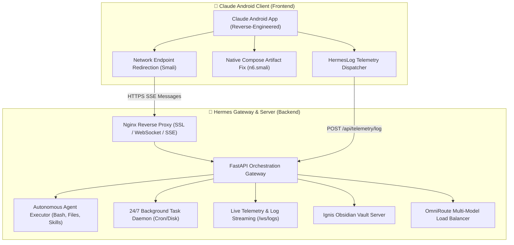

# 🚀 Hermes — Autonomous AI Agent Platform & Reverse-Engineered Claude Android Client

[](LICENSE)
[](https://github.com/JishnuPG-tech/Hermes)
[](https://jishnupg-hermes.hf.space)

A complete, full-stack autonomous AI ecosystem combining a **custom reverse-engineered Claude Android APK** with a **high-performance multi-model gateway**, autonomous server tool execution engine, 24/7 background task scheduler, real-time mobile telemetry, and interactive Obsidian notes management.

---

## 🏛️ System Architecture



---

## 📁 Repository Organization

```text
├── Frontend/                 # Claude Android APK Reverse Engineering & Smali Sources
│   ├── smali/                # 39 Custom Patched Smali Bytecode Files
│   │   ├── smali/            # Core network rewriters, auth, and telemetry logger
│   │   ├── smali_classes2/   # OkHttp & Cronet connection rewrite pipelines
│   │   ├── smali_classes3/   # Endpoint dispatchers & background sync service
│   │   └── smali_classes4/   # Compose UI renderers & artifact previews
│   ├── src/                  # Human-Readable Java Reference Implementations
│   │   ├── HermesLog.java    # Async telemetry & crash reporting
│   │   ├── NetworkRedirector.java # URL rewriter specification
│   │   └── ArtifactPatch.java # Native Compose artifact sanitizer
│   ├── patches/              # Standalone Bytecode Patches (n6_artifact_fix.smali)
│   ├── AndroidManifest.xml   # Patched Android manifest & security permissions
│   ├── apktool.yml           # Decompile & packaging definitions
│   ├── CLAUDE.md             # Reverse engineering & build notes
│   ├── README.md             # Detailed Frontend documentation & build instructions
│   └── scripts/              # Automated APK extractors & patchers
│
├── Backend/                  # Unified AI Gateway & Autonomous Server Microservices
│   ├── gateway/
│   │   ├── agent_executor.py   # Universal multi-turn autonomous tool engine
│   │   ├── claude_rest_api.py  # Claude mobile REST protocol & AI title generation
│   │   ├── anthropic_bridge.py # Anthropic Messages API proxy with thinking support
│   │   ├── background_agent.py # 24/7 persistent daemon & cron task manager
│   │   ├── telemetry.py        # Live log streaming & APK event ingestion
│   │   └── main.py             # FastAPI gateway router orchestration
│   ├── ignis/                  # Obsidian documentation & notes server
│   ├── Dockerfile              # Production container specification
│   ├── entrypoint.sh           # Multi-daemon supervisor (Redis, OmniRoute, Ignis, Gateway)
│   ├── nginx.conf              # Reverse proxy configuration
│   ├── clean_db.py             # Key-hash guard and clean DB checker
│   ├── fix_omniroute.py        # Database migration and sqlite3 fix
│   ├── health_doctor.py        # Self-healing diagnostic daemon
│   ├── ARCHITECTURE.md         # Deep technical architecture specification
│   └── README.md               # Detailed Backend documentation
│
├── LICENSE                   # MIT Open-Source License
└── README.md                 # Complete project documentation & quickstart guide
```

---

## ⚡ Highlights & Engineering Innovations

### 📱 1. Reverse-Engineered Mobile Client
- **Seamless Backend Redirection**: Bypassed Anthropic Cloudflare certificate pinning and re-routed OkHttp / Cronet network calls to private gateway endpoints.
- **Native Artifact Rendering**: Resolved NullPointerExceptions in Jetpack Compose markdown blocks, enabling interactive cards for Markdown, HTML/JS web apps, SVGs, and code files.
- **Zero-Stall Reopen**: Fixed message tree index chaining so conversations reload immediately upon app launch without getting stuck on background loading banners.
- **Real-Time Device Telemetry**: Custom injected `HermesLog` class batches and dispatches mobile logs and events asynchronously.

### 🧠 2. Autonomous Multi-Turn Agent Engine
- **Direct Server Control**: The agent can autonomously run `bash` shell commands, read/write files, inspect directories, and activate specialized skills.
- **Continuous Turn Reasoning**: After executing a command (e.g. `ls /data`), the agent seamlessly continues and provides structured analyses, markdown tables, and findings without premature stream breaks.
- **Dynamic Skills System**: Activates specialized domain personas on-the-fly (`python-pro`, `fastapi-pro`, `docker-expert`, `database-architect`, `security-auditor`, `systematic-debugging`).
- **Authentic Claude Styling**: Clean GitHub-flavored markdown, monospace tags, structured headings, and zero generic decorative emojis.

### ⏰ 3. Persistent 24/7 Background Daemon
- Schedule tasks (e.g., hourly health checks, scraper pipelines, backups) that run continuously on the server 24/7 even when the mobile app is closed or the screen is locked.
- Fully persisted in `/data/hermes/scheduled_tasks.json`.

### 🏷️ 4. AI-Driven Title Generator
- Fast background language model automatically assigns clean, professional 3–6 word titles to all chat sessions upon creation.

---

## 🛠️ Quickstart

### Building the Android APK
```bash
# 1. Build disassembled APK
apktool b Frontend -o build/Claude_Hermes_Unsigned.apk --use-aapt2

# 2. Align package
zipalign -p -f -v 4 build/Claude_Hermes_Unsigned.apk build/Claude_Hermes_Aligned.apk

# 3. Sign package
apksigner sign --ks debug.keystore --ks-pass pass:android --ks-key-alias androiddebugkey --out build/Claude_Hermes_Signed.apk build/Claude_Hermes_Aligned.apk
```

### Running the Backend Gateway
```bash
cd Backend
docker build -t hermes-gateway .
docker run -p 7860:7860 -v hermes_data:/data hermes-gateway
```

---

## 📜 License

This project is licensed under the [MIT License](LICENSE).
